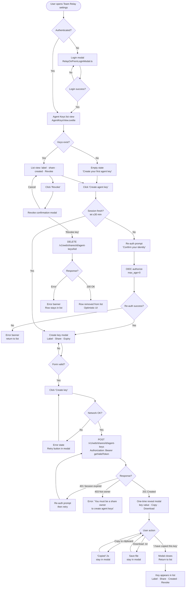

# Agent Keys — Design Doc: Plugin UI + Backend API

_Date: 2026-05-31 | Author: Daedalus | Status: Ready for implementation_

---

## Overview

Team Relay currently has no way for external tools (Mesh agents, CI pipelines, local scripts) to write to a share without using a user's personal JWT. This doc specifies the Agent Key feature end-to-end: the backend API changes required on the control plane and the Obsidian plugin UX for creating, listing, and revoking keys. The backend table and endpoints already exist (migration `202605220001`); this doc targets the gaps (auth tightening, missing field population, rate limits, audit logging) and the plugin UI that does not exist yet.

---

## Backend API Design

_Date: 2026-05-31 | Designed by: Daedalus_

---

### 1. Current State Snapshot (What Already Exists)

The `share_agent_keys` table and all three CRUD endpoints landed in migration `202605220001` (2026-05-22). The table schema and endpoints are already production-present. This spec does **not** propose a greenfield build — it proposes targeted changes to fix known gaps in the existing implementation.

**Existing table: `share_agent_keys`**

| Column | Type | Notes |
|--------|------|-------|
| `id` | UUID PK | `uuid4()` default |
| `share_id` | UUID FK → `shares.id` CASCADE | indexed |
| `key_hash` | VARCHAR(64) UNIQUE | SHA-256 hex of raw key, indexed |
| `label` | VARCHAR(255) nullable | user-provided name |
| `scopes` | VARCHAR(255) | hardcoded `"write"` at creation |
| `created_by` | UUID FK → `users.id` SET NULL nullable | **not populated at creation — bug** |
| `last_used_at` | TIMESTAMPTZ nullable | **not updated on upload — bug** |
| `expires_at` | TIMESTAMPTZ nullable | optional TTL |
| `revoked_at` | TIMESTAMPTZ nullable | soft-revoke timestamp |
| `created_at` | TIMESTAMPTZ | server_default now() |
| `updated_at` | TIMESTAMPTZ | server_default now() |

**Existing endpoints** (`agent_keys.py`, router prefix `/v1/web/shares/{share_id}/agent-keys`):

| Method | Path | Status |
|--------|------|--------|
| POST | `/v1/web/shares/{share_id}/agent-keys` | Exists, needs fixes |
| GET | `/v1/web/shares/{share_id}/agent-keys` | Exists, correct |
| DELETE | `/v1/web/shares/{share_id}/agent-keys/{key_id}` | Exists, correct |

---

### 2. Endpoint Design

#### Architecture Decision: Option C (partial)

Use the existing share-scoped paths for all operations. The `/v1/me/agent-keys` cross-share list endpoint is **deferred to backlog** — it requires an account-scope key concept that does not exist yet, and adds no value for the Obsidian plugin (which is always operating in the context of a specific share). The plugin can aggregate per-share lists client-side if needed.

**Chosen path structure:**
```
POST   /v1/web/shares/{share_id}/agent-keys          # create
GET    /v1/web/shares/{share_id}/agent-keys          # list (exists)
DELETE /v1/web/shares/{share_id}/agent-keys/{key_id} # revoke (exists)
```

---

#### 2.1 POST `/v1/web/shares/{share_id}/agent-keys` — Create

**Current state:** exists. Needs three fixes: populate `created_by`, restrict to owners/admins, enforce per-share key count.

**Authentication**

Accepts only the control plane's own locally-minted HS256 JWT as `Authorization: Bearer <token>`. This is the same token already stored in `RelayOnPremAuthStore` and sent by all existing plugin API calls. No Casdoor JWT is accepted — see Section 4 on why Casdoor JWT middleware is not needed.

Caller must be: global admin OR share owner. **Not** any share member (see Section 5 — current `_require_share_owner_or_admin` is misnamed and accepts viewers; this must be tightened).

**Request**

```
POST /v1/web/shares/{share_id}/agent-keys
Authorization: Bearer <cp_jwt>
Content-Type: application/json
```

```json
{
  "label": "My Agent Config",
  "expires_at": "2027-01-01T00:00:00Z"
}
```

| Field | Type | Required | Validation |
|-------|------|----------|------------|
| `label` | string | no | max 255 chars; trimmed; defaults to `null` |
| `expires_at` | ISO 8601 datetime | no | must be future; max 2 years from now; `null` = no expiry |

**Response 201**

```json
{
  "id": "550e8400-e29b-41d4-a716-446655440000",
  "key": "tr_agent_a3f8b2c1d4e5f6a7b8c9d0e1f2a3b4c5d6e7f8a9b0c1d2e3",
  "label": "My Agent Config",
  "scopes": ["write"],
  "share_id": "...",
  "expires_at": "2027-01-01T00:00:00Z",
  "created_at": "2026-05-31T10:00:00Z"
}
```

The `key` field contains the raw secret. It is shown **once only**. It is not stored — only its SHA-256 hash is persisted. The `key` field is absent from all subsequent GET responses.

**Error responses**

| Status | Condition |
|--------|-----------|
| 401 | Missing or invalid Bearer token |
| 403 | Authenticated but caller is not owner or global admin of this share |
| 404 | `share_id` does not exist |
| 409 | Per-share key limit reached (default: 20 active non-revoked keys; see Section 5) |
| 422 | `expires_at` is in the past or more than 2 years out; `label` > 255 chars |
| 429 | Creation rate limit hit (see Section 5) |

---

#### 2.2 GET `/v1/web/shares/{share_id}/agent-keys` — List

**Current state:** exists, needs two field additions: `is_active` (computed) and `created_by` (UUID). Both are part of the same fix pass as populating `created_by` on create — they are a single code change, not a future enhancement.

**Authentication:** same as POST — Bearer CP JWT, owner or admin only (tighten from current any-member).

**Response 200**

```json
[
  {
    "id": "550e8400-...",
    "label": "My Agent Config",
    "scopes": ["write"],
    "share_id": "...",
    "created_by": "user-uuid",
    "created_at": "2026-05-31T10:00:00Z",
    "last_used_at": "2026-05-31T11:30:00Z",
    "expires_at": "2027-01-01T00:00:00Z",
    "revoked_at": null,
    "is_active": true
  }
]
```

`is_active` is a computed field: `revoked_at IS NULL AND (expires_at IS NULL OR expires_at > now())`. Computed in Python, not stored. Saves the plugin from duplicating this logic.

Raw `key` value is **never** returned in list or any subsequent GET.

**Error responses**

| Status | Condition |
|--------|-----------|
| 401 | Missing or invalid Bearer token |
| 403 | Not owner or admin |
| 404 | Share not found |

---

#### 2.3 DELETE `/v1/web/shares/{share_id}/agent-keys/{key_id}` — Revoke

**Current state:** exists and correct (soft-revoke via `revoked_at`). No structural changes needed beyond the auth tightening.

**Authentication:** Bearer CP JWT, owner or admin only.

**Response 200**

```json
{
  "id": "550e8400-...",
  "revoked_at": "2026-05-31T12:00:00Z"
}
```

Idempotent: revoking an already-revoked key returns 200 with the original `revoked_at`. Revoking a non-existent key returns 404.

**Error responses**

| Status | Condition |
|--------|-----------|
| 401 | Missing or invalid Bearer token |
| 403 | Not owner or admin |
| 404 | Key not found or does not belong to this share |

---

### 3. Database Changes

#### 3.1 No new table required

`share_agent_keys` already exists with the correct schema. Two columns exist but are not used:

- `created_by` — column exists, FK defined, but `agent_keys.py:106–112` does not set it. Fix: populate at creation time with `user_id` extracted from the validated JWT.
- `last_used_at` — column exists, but `web.py:1137–1175` (the upload endpoint) does not update it after a successful upload auth check. Fix: add an async fire-and-forget update after the key lookup succeeds.

#### 3.2 Required migration: add key count index

The per-share active key count check (for the 20-key cap enforcement) will run a query like:

```sql
SELECT COUNT(*) FROM share_agent_keys
WHERE share_id = $1 AND revoked_at IS NULL;
```

The `share_id` index already exists (`ix_share_agent_keys_share_id`). No additional index is needed for this query, but a partial index would be more efficient for large deployments:

```python
# Migration: 202606010001_add_share_agent_keys_active_index.py
op.create_index(
    "ix_share_agent_keys_share_id_active",
    "share_agent_keys",
    ["share_id"],
    postgresql_where=sa.text("revoked_at IS NULL"),
)
```

#### 3.3 Migration: backfill `created_by`

Keys created before this fix have `created_by = NULL`. This is acceptable — display as "Unknown" in the plugin UI. No backfill migration needed; the column was designed nullable for exactly this case.

#### 3.4 Migration: update `last_used_at` on upload

No schema change required. Only code change: in `web.py` after line 1175 (scope check passes), add:

```python
# fire-and-forget last_used_at update
agent_key.last_used_at = security.utcnow()
db.add(agent_key)
db.commit()
```

Note: this is a synchronous DB write on the upload hot path. If upload latency becomes a concern, move to a background task via FastAPI's `BackgroundTasks`. For current scale, synchronous is acceptable.

---

### 4. Authentication: Casdoor JWT Validation

#### Decision: No Casdoor JWT middleware needed

The research confirms (`security.py:48–50`, `oauth.py:200–210`): all auth paths — local password and Casdoor OAuth — converge to the same locally-minted HS256 JWT before any API call. The control plane never accepts a Casdoor-issued JWT as a Bearer credential, and no code path does JWKS validation.

**Why this is correct for the agent-keys use case:**

The Obsidian plugin completes Casdoor OAuth once (via webview redirect), receives a local CP JWT, and stores it in `RelayOnPremAuthStore`. All subsequent API calls use this local JWT. The agent-key CRUD endpoints are called from the plugin — not from Casdoor directly. Adding Casdoor JWT middleware would create a second auth path with different security properties (RS256, external key rotation, network dependency on Casdoor at request time) for no benefit.

**Auth flow for the agent-keys API (current and proposed):**

```
Plugin login (Casdoor path)
  → GET /v1/auth/oauth/casdoor/authorize
  → [Casdoor auth completes]
  → GET /v1/auth/oauth/casdoor/callback
  → control plane calls security.create_access_token()
  → returns HS256 JWT to plugin
  → plugin stores in RelayOnPremAuthStore

Later: plugin calls agent-keys endpoint
  → Authorization: Bearer <hs256_jwt>
  → _require_share_owner_or_admin() calls security.decode_access_token()
  → HS256 validation against jwt_secret
  → user_id extracted from "sub" claim
  → share ownership/admin check
  → proceed
```

No Casdoor JWKS endpoint, no `python-jose` RS256 verification, no network call to Casdoor at request time.

**What a Casdoor-only user (no local password) can do today:** fully create, list, and revoke agent keys, because the OAuth callback mints a local HS256 JWT indistinguishable from a password-login JWT. This is the correct behavior and requires no changes.

---

### 5. Security Design

#### 5.1 Fix: Restrict CRUD to Share Owners and Global Admins

**Current bug:** `_require_share_owner_or_admin` accepts any `ShareMember` (including viewer-role members). The function name implies restriction; the code does not enforce it.

**Fix in `agent_keys.py:54–61`:**

```python
# Current (incorrect):
is_authorized = user.is_admin or share.owner_user_id == user_id
if not is_authorized:
    member_stmt = select(models.ShareMember).where(...)
    member = db.execute(member_stmt).scalar_one_or_none()
    is_authorized = member is not None  # accepts ANY member role

# Fixed:
is_authorized = user.is_admin or share.owner_user_id == user_id
# Remove the member fallback entirely — key management is owner/admin only
```

Viewer-role members can read share contents but cannot create or revoke credentials that grant write access. This matches the expected ownership semantics and what the plugin UI will imply.

#### 5.2 Key Format

**Existing format:** `tr_agent_` + `secrets.token_hex(24)` → total 57 chars (`tr_agent_` = 9 chars + 48 hex chars).

This format is already implemented and live. It is adequate. No change proposed.

Rationale for keeping it:
- `tr_agent_` prefix is recognizable in logs and config files. Secret scanners can be trained on it.
- 24 bytes = 192 bits of entropy from `secrets.token_hex`. Collision probability is negligible at any realistic scale.
- SHA-256 of 57-char string stored as 64-char hex — correct, no truncation.

#### 5.3 Rate Limits

| Limit | Value | Rationale |
|-------|-------|-----------|
| Max active keys per share | 20 | Prevents key sprawl; agents rarely need more than 2–5 per share |
| Key creation rate per user | 10 per hour | Prevents programmatic bulk creation |
| Key creation rate per share | 20 per hour | Separate from per-user to catch coordinated abuse |

Enforcement point: at the top of `create_agent_key()`, before DB write:

```python
# 1. Count active keys for this share
active_count_stmt = select(func.count()).where(
    models.ShareAgentKey.share_id == share.id,
    models.ShareAgentKey.revoked_at.is_(None),
)
active_count = db.execute(active_count_stmt).scalar_one()
if active_count >= settings.agent_key_max_per_share:  # default 20
    raise HTTPException(
        status_code=status.HTTP_409_CONFLICT,
        detail=f"Share has reached the maximum of {settings.agent_key_max_per_share} active agent keys.",
    )
```

Rate-limit header on 429 response: `Retry-After: <seconds>`.

#### 5.4 Expiry Policy

- **No mandatory expiry.** Forcing expiry creates friction for always-on agent configurations.
- **Optional TTL on creation.** Plugin UI presents expiry as an optional field with a suggested "1 year" default (pre-filled, not mandatory).
- **Maximum TTL cap (server-enforced):** reject `expires_at` more than 2 years from creation time.
- **Cleanup:** a periodic background task (daily) can mark expired keys as revoked. The `is_active` computed field in list responses already hides them from the plugin UI in the meantime.

#### 5.5 Audit Log

No separate audit table. Record events in Python's standard logger at `INFO` level with structured fields.

**Events to log:**

```python
# On create:
logger.info(
    "agent_key.created",
    extra={
        "event": "agent_key.created",
        "key_id": str(agent_key.id),
        "share_id": str(share.id),
        "created_by": str(user_id),
        "label": payload.label,
        "expires_at": payload.expires_at.isoformat() if payload.expires_at else None,
        "scopes": agent_key.scopes,
        "ip": request.client.host if request.client else None,
    }
)

# On revoke:
logger.info(
    "agent_key.revoked",
    extra={
        "event": "agent_key.revoked",
        "key_id": key_id,
        "share_id": share_id,
        "revoked_by": str(user_id),
        "ip": request.client.host if request.client else None,
    }
)

# On upload auth (key use):
logger.info(
    "agent_key.used",
    extra={
        "event": "agent_key.used",
        "key_id": str(agent_key.id),
        "share_id": str(share.id),
        "path": path,
        "ip": request.client.host if request.client else None,
    }
)
```

The raw key value is **never** logged. Only `key_id` (the UUID).

---

### 6. Code Changes Required (Prioritized)

| File | Change | Priority |
|------|--------|----------|
| `app/api/routers/agent_keys.py` | Remove viewer-member fallback from `_require_share_owner_or_admin`; populate `created_by` on create; add active-key count check; add `share_id` to create response; add `is_active` computed field to list response; add audit log calls | High |
| `app/api/routers/web.py` | After key auth passes at line 1175: update `agent_key.last_used_at` and commit; add `agent_key.used` audit log | High |
| `app/db/migrations/` | New migration `202606010001` for partial index on `share_agent_keys (share_id) WHERE revoked_at IS NULL` | Medium |
| `app/core/config.py` | Add `agent_key_max_per_share: int = 20` and `agent_key_creation_rate_per_hour: int = 10` to `Settings` | Medium |
| `app/api/routers/agent_keys.py` | Add `@limiter.limit("{agent_key_creation_rate_per_hour}/hour")` decorator to `create_agent_key`, keyed on `get_remote_address`. Import `limiter` from `app.core.limiter` (same pattern as `auth.py` and `shares.py`). Returns 429 with `Retry-After` header when triggered. | Medium |

---

### 7. Mermaid Sequence Diagram

```mermaid
sequenceDiagram
    autonumber
    participant Plugin as Obsidian Plugin<br/>(relay-onprem mode)
    participant CP as Control Plane<br/>(/v1)
    participant Casdoor as Casdoor SSO
    participant DB as PostgreSQL<br/>(share_agent_keys)
    participant Agent as Mesh Agent<br/>(MCP/CLI)
    participant MinIO as MinIO Storage

    Note over Plugin,Casdoor: One-time login (already done; token persists in RelayOnPremAuthStore)
    Plugin->>CP: GET /v1/auth/oauth/casdoor/authorize
    CP-->>Plugin: 302 → Casdoor login URL
    Plugin->>Casdoor: [user authenticates in webview]
    Casdoor-->>Plugin: redirect to /v1/auth/oauth/casdoor/callback?code=...
    Plugin->>CP: GET /v1/auth/oauth/casdoor/callback?code=...
    CP->>Casdoor: exchange code → userinfo
    Casdoor-->>CP: {sub, email, ...}
    CP->>DB: upsert user row; create user_sessions row
    CP->>CP: security.create_access_token(user_id) → HS256 JWT
    CP-->>Plugin: {access_token, refresh_token}
    Plugin->>Plugin: store JWT in RelayOnPremAuthStore

    Note over Plugin,DB: Agent key creation (new flow — plugin settings UI)
    Plugin->>CP: POST /v1/web/shares/{share_id}/agent-keys<br/>Authorization: Bearer {hs256_jwt}<br/>{"label": "My Agent", "expires_at": null}
    CP->>CP: security.decode_access_token(token) → user_id
    CP->>DB: SELECT share WHERE id=share_id
    CP->>DB: assert user is owner or global admin
    CP->>DB: SELECT COUNT(*) active keys WHERE share_id (cap check)
    CP->>CP: raw_key = "tr_agent_" + secrets.token_hex(24)<br/>key_hash = sha256(raw_key)
    CP->>DB: INSERT share_agent_keys (share_id, key_hash, label, created_by=user_id, scopes="write")
    CP->>CP: logger.info("agent_key.created", key_id=..., created_by=user_id)
    CP-->>Plugin: 201 {"id": "...", "key": "tr_agent_...", "label": "...", "created_at": "..."}
    Plugin->>Plugin: show key in one-time-reveal modal<br/>(never stored in plugin settings)

    Note over Plugin,DB: User copies key → pastes into agent config file

    Note over Agent,MinIO: Agent upload (existing flow, now with last_used_at fix)
    Agent->>CP: POST /v1/web/shares/{slug}/upload?path=notes/output.md<br/>X-Agent-Key: tr_agent_...
    CP->>CP: key_hash = sha256(X-Agent-Key header value)
    CP->>DB: SELECT share_agent_keys WHERE key_hash=...
    DB-->>CP: agent_key row
    CP->>CP: verify: share matches slug, not revoked, not expired, scopes has "write"
    CP->>DB: UPDATE share_agent_keys SET last_used_at=now() WHERE id=key_id
    CP->>CP: logger.info("agent_key.used", key_id=..., path=...)
    CP->>MinIO: PUT web-assets/{share_id}/notes/output.md
    CP->>DB: upsert share.web_folder_items; bump web_content_updated_at
    CP-->>Agent: 200 {"message": "uploaded", "path": "notes/output.md", "size": 1024}
    Note over Plugin: Next sync cycle: plugin pulls updated folder items
```

---

### 8. Open Items for Gandalf (Backend)

| # | Task | Blocking |
|---|------|---------|
| 1 | Fix `_require_share_owner_or_admin`: remove viewer-member fallback, restrict to owner + global admin | Plugin UI (users expect ownership semantics) |
| 2 | Populate `created_by` in `create_agent_key()` (`agent_keys.py:106`) | Audit completeness |
| 3 | Update `last_used_at` on successful upload auth (`web.py`, after line 1175) | Plugin UI shows last-used |
| 4 | Add active-key count cap (default 20) in `create_agent_key()` before DB insert | Rate safety |
| 5 | Add `share_id` and `scopes` to `AgentKeyCreateResponse` | Plugin needs to confirm scoping |
| 6 | Add `is_active` computed field to `AgentKeyListItem` | Plugin active/inactive badge |
| 7 | Structured audit logging (create / revoke / use events) | Operator observability |
| 8 | Migration `202606010001`: partial index on `share_id WHERE revoked_at IS NULL` | Performance (low urgency) |
| 9 | `agent_key_max_per_share` config knob in `Settings` | Operator configurability |

---

## Plugin UX Design

---

### Placement Decision

**Recommendation: Option C — Settings as primary surface, share context as secondary shortcut.**

**Rationale:**

The research identifies two distinct user moments when agent keys become relevant:

1. **Global credential audit** — "what keys do I have, across all my shares?" A user setting up a new agent config or rotating keys needs a single place to see everything. This belongs in Settings.

2. **In-context provisioning** — "I'm configuring this share right now and I want a key for it." A user who is already looking at a share detail view should not have to navigate elsewhere.

Option A alone fails moment 2 — too much navigation cost when the user is already at the resource. Option B alone fails moment 1 — no canonical list, no cross-share audit surface, poor discoverability. The Anthropic Console gets this right: API Keys is a first-class section in the nav, not a sub-menu of individual resources.

**Selected architecture:**

- **Primary**: "Agent Keys" entry in the server settings nav sidebar, rendered as a full list view (`AgentKeysView.svelte`)
- **Secondary**: "Create agent key" button inline in the share detail view, pre-filling the share selector in the create modal
- **Deferred**: web UI, account-scoped keys

---

### User Flow (Step by Step)

**Path A: via Settings (discovery / management)**

1. User opens Obsidian, clicks the Team Relay ribbon icon or opens Command Palette → "Team Relay: Open settings"
2. Plugin opens the relay settings panel. If not yet authenticated, login modal appears first (existing `RelayOnPremLoginModal.ts` flow).
3. Left sidebar shows the server list. Under the connected server, user sees nav items: Shares · Members · Billing · **Agent Keys** (new).
4. User clicks **Agent Keys**. `AgentKeysView.svelte` renders with the full key list for all shares this user owns, grouped by share name.
5. If no keys exist yet → empty state with a single "Create your first agent key" CTA.
6. User clicks **Create agent key** button (top-right of list, or the CTA).
7. **Soft re-auth check**: plugin reads `RelayOnPremAuthStore` and decodes the JWT `iat` claim. If token was issued more than 30 minutes ago, a banner appears: "Creating agent keys requires confirming your identity." Button reads "Continue to sign in" → plugin initiates OIDC authorize with `max_age=0` (force re-authentication). On callback, plugin re-stores the new JWT and returns the user to the create modal. If the server is unreachable (offline), skip re-auth silently.
8. **Create key modal** opens. Fields: Label (required), Share (dropdown of user's owned shares), Expiry (optional, date picker — default: no expiry).
9. User fills in label, selects share, clicks **Create key**.
10. Plugin calls `POST /v1/web/shares/{share_id}/agent-keys` with `Authorization: Bearer {getValidToken()}` and body `{label, expires_at}`.
11. On 201 response: create modal closes, **one-time reveal modal** opens immediately with the raw key value.
12. User copies the key (copy button or manual selection), clicks **"I've copied this key"** to dismiss.
13. User is returned to the key list. The new key appears in the list with: label, share name, created timestamp, "never expires" or expiry date, **Revoke** button. Raw key is never shown again.
14. User pastes the key into `relay_mcp.py` config (or `.env` file) as the `AGENT_KEY` value.

**Path B: via share detail (in-context provisioning)**

1. User opens Team Relay sidebar, navigates to a specific share.
2. In the share detail view, alongside existing "Members" and "Settings" buttons, a new **"Agent Keys"** button appears.
3. User clicks it → create key modal opens, share selector is pre-filled and locked to this share.
4. Steps 7–14 from Path A continue identically.

---

### Screen Designs

#### Agent Keys List View

```
┌─────────────────────────────────────────────────────────────┐
│  ← Team Relay Settings · my-relay-server                   │
├─────────────────────────────────────────────────────────────┤
│  Shares  Members  Billing  [Agent Keys]                     │
├─────────────────────────────────────────────────────────────┤
│                                                             │
│  Agent Keys                          [+ Create agent key]  │
│  ─────────────────────────────────────────────────────────  │
│                                                             │
│  Share: research-vault                                      │
│  ┌────────────────────┬──────────────────┬──────────────┐   │
│  │ Label              │ Created          │              │   │
│  ├────────────────────┼──────────────────┼──────────────┤   │
│  │ local-agent-v1     │ 2026-05-31       │ [Revoke]     │   │
│  │ ci-pipeline        │ 2026-05-28       │ [Revoke]     │   │
│  └────────────────────┴──────────────────┴──────────────┘   │
│                                                             │
│  Share: team-notes                                          │
│  ┌────────────────────┬──────────────────┬──────────────┐   │
│  │ Label              │ Created          │              │   │
│  ├────────────────────┼──────────────────┼──────────────┤   │
│  │ daedalus-agent     │ 2026-05-20       │ [Revoke]     │   │
│  └────────────────────┴──────────────────┴──────────────┘   │
│                                                             │
│  Share: archive-2025                                        │
│  ╌╌ No agent keys ╌╌                    [+ Create key]      │
│                                                             │
└─────────────────────────────────────────────────────────────┘
```

Notes: no raw key value anywhere in this view. "Revoke" is styled in muted red, not the primary action color. The "Created" column uses relative time (e.g. "3 days ago") with full date on hover. Once `last_used_at` is populated by the backend fix, a "Last used" column appears here.

---

#### Create Key Modal

```
┌──────────────────────────────────────────┐
│  Create agent key                    [×] │
├──────────────────────────────────────────┤
│                                          │
│  Label *                                 │
│  ┌──────────────────────────────────┐    │
│  │ e.g. "local-agent-v2"            │    │
│  └──────────────────────────────────┘    │
│  Used to identify this key in the list   │
│                                          │
│  Share *                                 │
│  ┌──────────────────────────────────┐    │
│  │ research-vault               [▾] │    │
│  └──────────────────────────────────┘    │
│  (only shows shares you own or admin)    │
│                                          │
│  Expires                                 │
│  ┌──────────────────────────────────┐    │
│  │ Never (default)              [▾] │    │
│  └──────────────────────────────────┘    │
│  Options: 30 days · 90 days · 1 year ·   │
│           Custom date · Never            │
│                                          │
│  ─────────────────────────────────────   │
│                 [Cancel]  [Create key]   │
└──────────────────────────────────────────┘
```

Notes: "Create key" button is disabled until label is non-empty. Share selector shows only shares where the user is owner (aligned to the permissions fix, even before the backend patch lands — optimistic UI, will 403 otherwise). If opened from share context, the share selector is replaced with a static text label showing the share name (no dropdown).

---

#### One-Time Reveal Modal

```
┌──────────────────────────────────────────────────┐
│  Agent key created                           [×] │
├──────────────────────────────────────────────────┤
│                                                  │
│  ⚠  This key will not be shown again.            │
│     Copy it now and store it securely.           │
│                                                  │
│  ┌────────────────────────────────────────────┐  │
│  │ tr_agent_4a7f2c1e9b3d6082a5f1c8e4b9d7...  │  │
│  └────────────────────────────────────────────┘  │
│  (monospace, full width, selectable)             │
│                                                  │
│              [Copy to clipboard]  [Download .txt]│
│                                                  │
│  ─────────────────────────────────────────────   │
│  Label:   local-agent-v2                         │
│  Share:   research-vault                         │
│  Expires: Never                                  │
│  ─────────────────────────────────────────────   │
│                                                  │
│            [I've copied this key — close]        │
└──────────────────────────────────────────────────┘
```

Notes:
- The `[×]` close button triggers a confirmation before silently dismissing (second click required after warning).
- "Copy to clipboard" changes to "Copied" for 2 seconds after click, then resets. Does not close the modal.
- "Download .txt" downloads `tr-agent-key-{label}-{date}.txt` with key value and metadata.
- "I've copied this key — close" is the primary dismiss path.
- Do not dismiss on backdrop click.

---

#### Revoke Confirmation

```
┌──────────────────────────────────────────────┐
│  Revoke agent key?                       [×] │
├──────────────────────────────────────────────┤
│                                              │
│  Revoking "local-agent-v1" will immediately  │
│  block any agent using this key from         │
│  uploading to research-vault.                │
│                                              │
│  This cannot be undone.                      │
│                                              │
│              [Cancel]  [Revoke key]          │
└──────────────────────────────────────────────┘
```

Notes: "Revoke key" is in a destructive color (Obsidian uses `--color-red`). No re-auth required. On success, the key row is removed immediately (optimistic UI).

---

### Auth Reuse

**Where the JWT lives in plugin code:**

The locally-minted HS256 JWT is stored in `RelayOnPremAuthStore` under localStorage key `evc-team-relay_onprem_auth_<vaultName>_<serverId>`. In memory, accessible via `RelayOnPremAuthProvider.token` (synchronous, possibly stale) or `RelayOnPremAuthProvider.getValidToken()` (async, refreshes if within 5-minute expiry window).

The correct method for any outbound API call — including agent key CRUD — is `getValidToken()`. The existing refresh mechanism (`POST /v1/auth/refresh` with 3 retry attempts at 0s/1s/3s delays) handles token renewal transparently.

**New methods to add to `RelayOnPremShareClient.ts`:**

```typescript
async createAgentKey(shareId: string, label: string, expiresAt?: string): Promise<AgentKeyCreateResponse> {
    const headers = await this.getHeaders();
    return this.customFetch(
        `${this.baseUrl}/v1/web/shares/${shareId}/agent-keys`,
        {
            method: 'POST',
            headers,
            body: JSON.stringify({ label, ...(expiresAt ? { expires_at: expiresAt } : {}) }),
        }
    );
}

async listAgentKeys(shareId: string): Promise<AgentKeyListItem[]> {
    const headers = await this.getHeaders();
    return this.customFetch(
        `${this.baseUrl}/v1/web/shares/${shareId}/agent-keys`,
        { method: 'GET', headers }
    );
}

async revokeAgentKey(shareId: string, keyId: string): Promise<void> {
    const headers = await this.getHeaders();
    return this.customFetch(
        `${this.baseUrl}/v1/web/shares/${shareId}/agent-keys/${keyId}`,
        { method: 'DELETE', headers }
    );
}
```

No changes to `RelayOnPremAuthProvider.ts`, `RelayOnPremAuthStore.ts`, or `IAuthProvider.ts`.

---

### AgentKeysView Data Loading Strategy

The top-level "Agent Keys" nav entry shows keys across **all owned shares** on the connected server. The component has two render modes depending on how it is invoked:

**Mode A — top-level view (from sidebar nav)**

`AgentKeysView.svelte` receives a `server: RelayOnPremServer` prop (not a `share` prop).

On mount:
1. Call `client.listShares()` — gets all shares the user has access to.
2. Filter to shares where `share.owner_user_id === currentUser.id` (client-side, no extra endpoint needed).
3. For each owned share, call `client.listAgentKeys(share.id)` in parallel (`Promise.all`).
4. Group results by share, render each group with a loading skeleton until its fetch resolves.
5. A share with zero keys renders the "No agent keys for this share" row with an inline `[+ Create key →]` button.

`RelayOnPremSettings.svelte` change: the `agentKeys` `ViewType` branch passes `{server}` (not `selectedShare`):

```svelte
<!-- RelayOnPremSettings.svelte — agentKeys case -->
{#if currentView === 'agentKeys'}
  <AgentKeysView {server} {client} {currentUser} onNavigate={navigateTo} />
{/if}
```

**Mode B — share-detail shortcut**

When the user clicks "Agent Keys" from a share detail view, `navigateTo('agentKeys', { filterShare: share })` is called. `AgentKeysView` receives the optional `filterShare` prop; if present, only that share's keys are shown and the share selector in the create modal is pre-filled and locked.

```svelte
<!-- RelayOnPremSettings.svelte — share detail 'Agent Keys' button -->
<button on:click={() => navigateTo('agentKeys', { filterShare: selectedShare })}>
  Agent Keys
</button>
```

**Component prop signature:**

```typescript
// AgentKeysView.svelte props
export let server: RelayOnPremServer;
export let client: RelayOnPremShareClient;
export let currentUser: AuthUser;
export let filterShare: ShareWithServer | undefined = undefined;
export let onNavigate: (view: ViewType, params?: NavigateParams) => void;
```

The existing `share: ShareWithServer` prop is **replaced** by this signature. Any existing callers that pass `share={selectedShare}` must be updated to `filterShare={selectedShare}` + `{server}`.

**Soft re-auth implementation:**

```typescript
// In AgentKeysView.svelte, before opening create modal:

async function checkSessionFreshness(): Promise<boolean> {
    const token = authProvider.token;  // synchronous read
    if (!token) return false;
    try {
        const payload = JSON.parse(atob(token.split('.')[1]));
        const iatMs = (payload.iat ?? 0) * 1000;
        return (Date.now() - iatMs) < 30 * 60 * 1000;  // 30 min window
    } catch {
        return false;  // malformed token → treat as stale
    }
}

async function onCreateClick() {
    const fresh = await checkSessionFreshness();
    if (!fresh) {
        await loginManager.reAuthForSensitiveAction();
        // new token already in store on return
    }
    openCreateModal();
}
```

`loginManager.reAuthForSensitiveAction()` is a new method on `LoginManager.ts`. Full signature and implementation:

```typescript
// LoginManager.ts — add to class LoginManager

/**
 * Forces re-authentication via OIDC with max_age=0 (Casdoor must re-prompt the user).
 * Awaits the OAuth callback and updates the stored token on success.
 * Throws if the user cancels or the flow times out (120s).
 */
async reAuthForSensitiveAction(serverId: string): Promise<void> {
    const provider = 'casdoor';
    // prepareOAuthFlow() builds the authorize URL; we append max_age=0
    const url = await this.oauthHandler.prepareOAuthFlow(provider);
    const reAuthUrl = url.includes('?')
        ? `${url}&max_age=0`
        : `${url}?max_age=0`;

    return new Promise((resolve, reject) => {
        const timeout = setTimeout(() => {
            reject(new Error('Re-authentication timed out.'));
        }, 120_000);

        this.oauthHandler.openOAuthWebview(reAuthUrl, async (callbackUrl: string) => {
            clearTimeout(timeout);
            try {
                const newToken = await this.oauthHandler.handleCallback(callbackUrl, serverId);
                await this.authProvider.storeToken(newToken);
                resolve();
            } catch (err) {
                reject(err);
            }
        }, () => {
            // user closed the webview without completing
            clearTimeout(timeout);
            reject(new Error('Re-authentication was cancelled.'));
        });
    });
}
```

Caller in `AgentKeysView.svelte` should catch the rejection and show an inline error banner rather than propagating it to an unhandled rejection:

```typescript
async function onCreateClick() {
    const fresh = await checkSessionFreshness();
    if (!fresh) {
        try {
            await loginManager.reAuthForSensitiveAction(server.id);
        } catch (err) {
            errorMessage = err instanceof Error ? err.message : 'Re-authentication failed.';
            return;
        }
    }
    openCreateModal();
}
```

---

### Mermaid Flow Diagram



---

### Edge Cases

**1. User session expired while creating a key**

The 401 response from the create call is caught in `RelayOnPremShareClient`. Plugin surfaces an inline error inside the create modal: "Your session has expired. Sign in again to continue." Two buttons: **Cancel** (closes modal, discards form) and **Sign in** (triggers login flow, returns user to the pre-filled modal on success — label and share selection are preserved in component state). Do not silently discard the form.

**2. Network error during create**

Create modal stays open (do not close on error). The "Create key" button returns to its enabled state. Inline error appears below the button: "Could not reach the server. Check your connection and try again." A **Retry** link re-submits immediately (same form state). No automatic retry loop — user-initiated only. The operation is not idempotent; silent retry would create duplicate keys.

**3. Key list empty state**

When `GET /v1/web/shares/{share_id}/agent-keys` returns empty arrays for all shares:

```
  No agent keys yet.

  Agent keys let external tools write to your shares
  without using your personal login credentials.

              [Create your first agent key]
```

**4. Share has no keys yet (within a populated list)**

```
  Share: archive-2025
  ╌╌ No agent keys for this share ╌╌     [+ Create key →]
```

The inline `[+ Create key →]` opens the create modal pre-filled to that share.

**5. Share disappeared between list load and revoke**

If a share is deleted between the key list fetch and the revoke action, the DELETE endpoint returns 404. Plugin handles this as a soft error: remove the key row from the UI (the underlying share is gone — the key is already inert) and show a brief notice: "This share has been removed. The key has been cleaned up."

**6. Concurrent session (two Obsidian windows, same vault)**

Both windows share the same localStorage auth store. The list view should refresh on visibility gain (`document.addEventListener('visibilitychange', ...)`) or on mount. Pull on focus is sufficient — no real-time push needed.

---

## Implementation Checklist

- [ ] Backend: Fix `_require_share_owner_or_admin` — remove viewer-member fallback
- [ ] Backend: Populate `created_by` on POST `/v1/.../agent-keys`
- [ ] Backend: Update `last_used_at` on upload auth success (`web.py`)
- [ ] Backend: Active key count cap (20 per share) before DB insert
- [ ] Backend: Add `share_id`, `scopes`, `is_active` to response schemas
- [ ] Backend: Structured audit log (create / revoke / use)
- [ ] Backend: DB migration `202606010001` — partial index on `share_id WHERE revoked_at IS NULL`
- [ ] Backend: `agent_key_max_per_share` config knob in `Settings`
- [ ] Backend: Rate limiting on create — `@limiter.limit` decorator, 429 with `Retry-After` on cap
- [ ] Plugin: `AgentKeysView.svelte` — list view grouped by share
- [ ] Plugin: Create key modal with label / share / expiry fields
- [ ] Plugin: One-time reveal modal with copy + download
- [ ] Plugin: Revoke confirmation modal
- [ ] Plugin: Share detail view — "Agent Keys" shortcut button
- [ ] Plugin: Soft re-auth check before create (`checkSessionFreshness`)
- [ ] Plugin: `loginManager.reAuthForSensitiveAction()` method
- [ ] Plugin: Three new methods on `RelayOnPremShareClient.ts`
- [ ] Plugin: Visibility-change refresh on key list view
- [ ] Tests: Backend unit — auth restriction, created_by population, count cap, audit log
- [ ] Tests: Backend integration — full create/list/revoke flow
- [ ] Tests: Plugin-level — modal states, error handling, optimistic revoke
- [ ] Docs: Quickstart for users at `entire.vc/docs/agent-keys/`

---

## Acceptance Criteria

**Backend (C1):**
1. `POST /v1/web/shares/{share_id}/agent-keys` returns 403 for viewer-role members (not just non-members).
2. Created key rows have `created_by` populated with the authenticated user's UUID.
3. Uploading a file via `X-Agent-Key` sets `last_used_at` on the key row.
4. Creating more than 20 active keys on one share returns 409.
5. Create response includes `share_id` and `scopes` fields.
6. List response includes `is_active` computed field.
7. Audit log lines appear in container stdout for create / revoke / use events. Raw key value absent from all logs.
8. Migration `202606010001` applies cleanly on a fresh DB and an existing DB with data.
9. Key creation rate limit: creating more than 10 keys per hour from the same IP returns 429 with `Retry-After` header.

**Plugin UX (C2):**
1. "Agent Keys" tab visible in server settings sidebar when authenticated.
2. List view groups keys by share name; "Created" column shows relative time.
3. Create modal: label required, share dropdown filtered to owned shares only, expiry optional.
4. One-time reveal modal: key shown once, copy button works, download saves a .txt file, modal requires explicit dismiss.
5. Revoke: confirmation modal shown; on confirm, row removed optimistically; 404 on missing share handled gracefully.
6. Soft re-auth triggered when JWT `iat` is >30 min old before opening create modal.
7. Session expired (401) during create: form preserved, re-auth prompt shown inline.
8. Network error during create: modal stays open, retry available, no silent retry loop.
9. List refreshes on window visibility gain.

**Docs (C4):**
1. User-facing quickstart covers: creating a key, using it in `relay_mcp.py`, revoking it.
2. No mention of internal implementation details.
